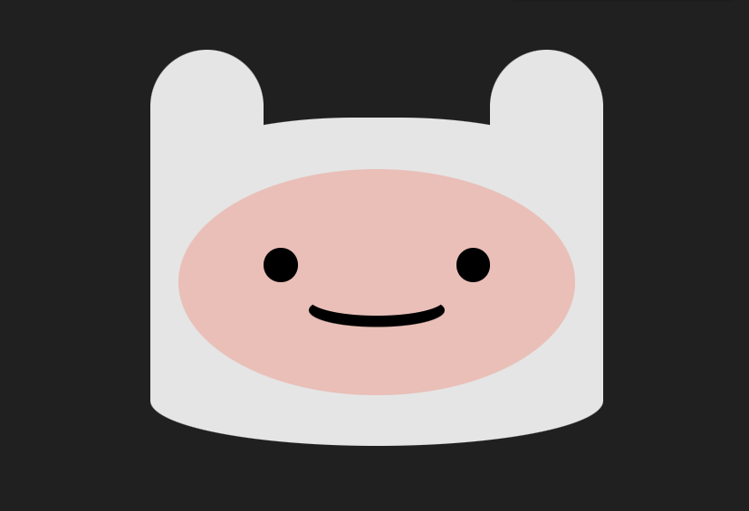

# Programando e desenvolvendo artes

O objetivo deste portfolio e utilizar algumas práticas relacionadas a estilos e desenhos, utilizando a programação para o desenvolvimento de artes, layouts e/ou cenários.

## Prévia do resultado:

